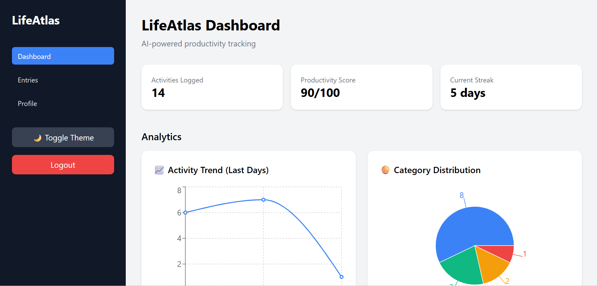
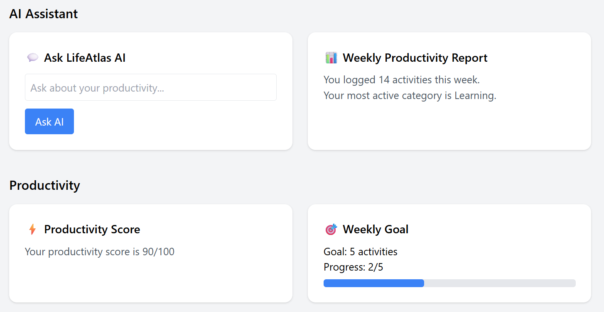
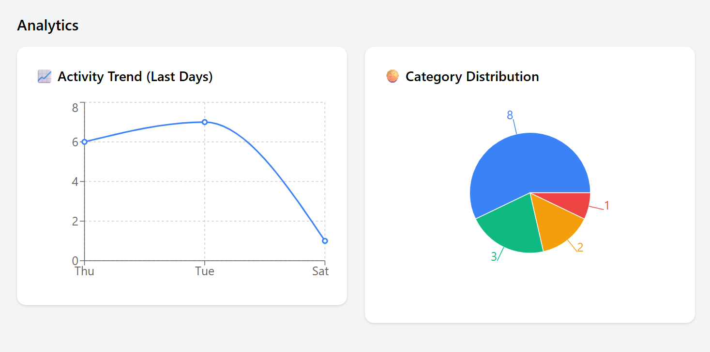

# 🚀 LifeAtlas – AI Powered Productivity Dashboard

LifeAtlas is a **full-stack AI powered productivity dashboard** that helps users track daily activities, analyze productivity habits, and receive intelligent insights powered by AI.

The platform combines **activity tracking, analytics dashboards, and AI assistance** to help users improve routines and maintain balanced productivity.

---

# 🌟 Features

## 🧠 AI Productivity Assistant

* AI powered productivity coach using **OpenAI**
* Habit recommendation engine
* AI chat assistant for productivity questions
* Weekly productivity insights

## 📊 Analytics Dashboard

* Activity trend charts
* Category distribution analysis
* Productivity score calculation
* Habit balance recommendations

## 📝 Activity Tracking

* Log daily activities
* Categorize tasks (Learning, Work, Health, Personal)
* Track progress over time
* View activity history timeline

## 🎯 Productivity System

* Weekly goal tracking
* Habit balance analysis
* AI productivity insights

## 🎨 UI / UX

* Modern dashboard layout
* Dark mode support
* Interactive analytics charts
* Responsive design

---

# 🛠 Tech Stack

## Frontend

* **React**
* **TailwindCSS**
* **Recharts**
* **React Router**

## Backend

* **Node.js**
* **Express.js**
* **MongoDB**
* **JWT Authentication**

## AI

* **OpenAI API**
* Activity pattern analysis
* AI productivity insights

---

# 📊 Dashboard Overview

LifeAtlas provides a modern productivity dashboard including:

* Activity tracking
* AI assistant
* Analytics charts
* Productivity scoring
* Habit recommendations

---

# 📷 Screenshots

### Dashboard



### AI Assistant




### Analytics



---

# ⚙️ Installation

Clone the repository

```bash
git clone https://github.com/YOUR_USERNAME/LifeAtlas.git
cd LifeAtlas
```

---

## Backend Setup

```bash
cd backend
npm install
npm run dev
```

Server runs on:

```
http://localhost:5000
```

---

## Frontend Setup

```bash
cd frontend
npm install
npm run dev
```

App runs on:

```
http://localhost:5173
```

---

# 🔐 Environment Variables

Create a `.env` file in **backend**:

```
PORT=5000
MONGO_URI=your_mongodb_connection
JWT_SECRET=your_secret
OPENAI_API_KEY=your_openai_key
```

---

# 📁 Project Structure

```
LifeAtlas
│
├── backend
│   ├── controllers
│   ├── models
│   ├── routes
│   ├── middleware
│   └── server.js
│
├── frontend
│   ├── src
│   │   ├── components
│   │   ├── pages
│   │   └── services
│   │
│   └── vite.config.js
│
├── screenshots
│
├── README.md
└── .gitignore
```

---

# 🌍 Live Demo

Coming soon 🚀

Deployment will be done using:

* **Frontend → Vercel**
* **Backend → Render**
* **Database → MongoDB Atlas**

---

# 📈 Future Improvements

Possible enhancements:

* Activity heatmap calendar
* AI habit predictions
* Notification system
* Export productivity reports
* Multi-user analytics

---

# 👨‍💻 Author

Developed by **Ritika**

If you found this project useful, consider giving it a ⭐ on GitHub.
